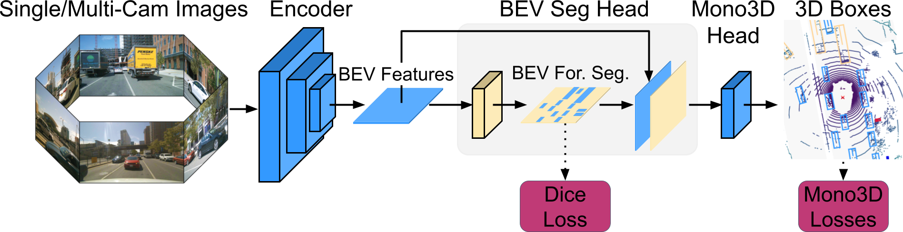

# [SeaBird: Segmentation in Bird's View with Dice Loss Improves Monocular 3D Detection of Large Objects](https://arxiv.org/pdf/2403.20318.pdf)

### [KITTI-360 Demo](https://www.youtube.com/watch?v=SmuRbMbsnZA)

[Abhinav Kumar](https://sites.google.com/view/abhinavkumar)<sup>1</sup>, 
[Yuliang Guo](https://yuliangguo.github.io)<sup>2</sup>, 
[Xinyu Huang](https://scholar.google.com/citations?user=cL4bNBwAAAAJ&hl=en)<sup>2</sup>, 
[Liu Ren](https://www.liu-ren.com)<sup>2</sup>, 
[Xiaoming Liu](http://www.cse.msu.edu/~liuxm/index2.html)<sup>1</sup> <br>
<sup>1</sup>Michigan State University, <sup>2</sup>Bosch Research North America, Bosch Center for AI

in [CVPR 2024](https://cvpr.thecvf.com/Conferences/2024/)



> Monocular 3D detectors achieve remarkable performance on cars and smaller objects. However, their performance drops on larger objects, leading to fatal accidents. Some attribute the failures to training data scarcity or the receptive field requirements of large objects. In this paper, we highlight this understudied problem of generalization to large objects. We find that modern frontal detectors struggle to generalize to large objects even on nearly balanced datasets. We argue that the cause of failure is the sensitivity of depth regression losses to noise of larger objects. To bridge this gap, we comprehensively investigate regression and dice losses, examining their robustness under varying error levels and object sizes. We mathematically prove that the dice loss leads to superior noise-robustness and model convergence for large objects compared to regression losses for a simplified case. Leveraging our theoretical insights, we propose SeaBird (Segmentation in Bird's View) as the first step towards generalizing to large objects. SeaBird effectively integrates BEV segmentation on foreground objects for 3D detection, with the segmentation head trained with the dice loss. SeaBird achieves SoTA results on the KITTI-360 leaderboard and improves existing detectors on the nuScenes leaderboard, particularly for large objects.


Much of the codebase is based on [PanopticBEV](https://github.com/robot-learning-freiburg/PanopticBEV). Some implementations are from [BBAVectors](https://github.com/yijingru/BBAVectors-Oriented-Object-Detection) and our [DEVIANT](https://github.com/abhi1kumar/DEVIANT.git).

[](https://arxiv.org/abs/2403.20318)
[](https://opensource.org/licenses/MIT)


## Citation

If you find our work useful in your research, please consider starring the repo and citing:

```Bibtex
@inproceedings{kumar2024seabird,
   title={{SeaBird: Segmentation in Bird's View with Dice Loss Improves Monocular $3$D Detection of Large Objects}},
   author={Kumar, Abhinav and Guo, Yuliang and Huang, Xinyu and Ren, Liu and Liu, Xiaoming},
   booktitle={CVPR},
   year={2024}
}
```

## Setup

- **Requirements**

  1. Python 3.7
  2. [PyTorch](http://pytorch.org) 1.11
  3. Torchvision 0.12
  4. Cuda 11.3
  5. Ubuntu 20.04

  This is tested with NVIDIA RTX6000 (48 GB) GPU. Other platforms have not been tested. Clone the repo first. Unless otherwise stated, the below scripts and instructions assume the working directory is the directory `SeaBird/PanopticBEV`:

  ```bash
  git clone https://github.com/abhi1kumar/SeaBird.git
  cd PanopticBEV
  ```


- **Cuda & Python**

  - Create a python conda environment and activate it.
    ```bash
    conda create -n panoptic python=3.7 -y
    conda activate panoptic
    conda install -c conda-forge ipython -y
    ```

  - Point to Cuda
    ```bash
    source cuda_11.3_env
    ```

    For MSU HPCC, use the command `module load CUDA/11.0.2 cuDNN/8.0.4.30-CUDA-11.0.2` instead of `source cuda_11.3_env`.

  - Install the python dependencies using the `requirements.txt` file. 
    ```bash
    pip install -r requirements.txt
    ```
    
  - Compile the PanopticBEV code with Cuda.
    ```bash
    python3 setup.py develop
    ```

  - Compile DoTA devkit for polygon NMS.
    ```bash
    cd panoptic_bev/data/DOTA_devkit
    swig -c++ -python polyiou.i
    python setup.py build_ext --inplace
    cd ../../..
    ```

- **KITTI-360 Data**
  - Download the [KITTI-360](http://www.cvlibs.net/datasets/kitti-360/) and [KITTI-360 PanopticBEV](http://panoptic-bev.cs.uni-freiburg.de/#dataset) datasets.
  - Download the processed KITTI-360 `train_val` and dummy `testing` [labels](https://drive.google.com/file/d/1h1VmHNdoIKRecJKANt1Wj_-nDNX_HCQG/view?usp=sharing). Extract them.

  - Arrange datasets as

```bash
SeaBird/PanopticBEV
├── data
│      └── kitti_360
│             ├── ImageSets
│             ├── KITTI-360
│             │      ├── calibration
│             │      ├── data_2d_raw
│             │      ├── data_2d_semantics
│             │      ├── data_3d_boxes
│             │      └── data_poses
│             ├── kitti360_panopticbev
│             │      ├── bev_msk
│             │      ├── class_weights
│             │      ├── front_msk_seam
│             │      ├── front_msk_trainid
│             │      ├── img
│             │      ├── split
│             │      ├── metadata_front.bin
│             │      └── metadata_ortho.bin 
│             ├── train_val
│             │      ├── calib
│             │      ├── label
│             │      └── label_dota
│             └── testing
│                    ├── calib
│                    ├── label
│                    └── label_dota
│ ...
```

Copy `metadata_ortho.bin` file 
```bash
cp data/kitti_360/kitti360_panopticbev/metadata_ortho.bin data/kitti_360/
```

Next, extract the BEV Segmentation labels and finally link the corresponding images.

```bash
python data/kitti_360/generate_BEV_semantic_seg_GT.py
python data/kitti_360/setup_split.py
```

You should see the following structure with `61056` samples in each sub-folder of `train_val` split, and `910` samples in each 
sub-folder of `testing` split.

```bash
SeaBird/PanopticBEV
├── data
│      └── kitti_360
│             ├── ImageSets
│             ├── train_val
│             │      ├── calib
│             │      ├── image
│             │      ├── label
│             │      ├── label_dota
│             │      ├── panop
│             │      └── seman
│             ├── testing
│             │      ├── calib
│             │      ├── image
│             │      ├── label
│             │      ├── label_dota
│             │      ├── panop
│             │      └── seman
│             └── metadata_ortho.bin
```

## Training

Train the model:

```bash
chmod +x scripts_training.sh
bash scripts_training.sh
```
The configuration parameters of the model are in the `experiments/` folder where you can modify the model parameters.

## Testing

### Model Zoo

We provide logs/models/predictions for the main experiments on KITTI-360 Val /KITTI-360 Test data splits available to download here.

| Data_Splits | Method  | Config<br/>(Run)                                          | Weight<br>/Pred  | Metrics | Lrg<br/>(50) | Car<br/>(50) | Mean<br/>(50) | Lrg<br/>(25) | Car<br/>(25) | Mean<br/>(25) | Lrg<br/>Seg | Car<br/>Seg | Mean<br/>Seg | 
|------------|---------|------------------------------------------------------------------|----------|--------|----------|-----------|----------|-----------|----------------|----|--------------|-----------|-----------|
| KITTI-360 Val  | Stage 1 | [seabird_val_stage1](experiments/pbev_seabird_kitti360_val_stage1.ini) | [gdrive](https://drive.google.com/file/d/17z02Tj92rQtYYVtiUd2O0grkmQ_ZGgdV/view?usp=sharing) | IoU  |   -   |   -   |   -   |   -   |   -   |   -   | 23.83 | 48.54 | 36.18 
| KITTI-360 Val  | PBEV+SeaBird | [seabird_val](experiments/pbev_seabird_kitti360_val.ini)          | [gdrive](https://drive.google.com/file/d/1iam4F50jX6Hf0WfvkIzkHRkNw_rq3U_p/view?usp=sharing) | AP   | 13.22 | 42.46 | 27.84 | 37.15 | 52.53 | 44.84 | 24.30 | 48.04 | 36.17
| KITTI-360 Test | PBEV+SeaBird | [seabird_test](experiments/pbev_seabird_kitti360_test.ini)        | [gdrive](https://drive.google.com/file/d/1YC3cWVOmX7bdoU21URnP24KlZLOF4q-D/view?usp=sharing) | AP   |   -   |   -   | 4.64  |   -   |   -   | 37.12 |   -   |   -   |   -   

### Testing Pre-trained Models

Make `output` folder in the `SeaBird` directory:

```bash
mkdir output
```

Place models in the `output` folder as follows:

```bash
SeaBird/PanopticBEV
├── output
│      ├── pbev_seabird_kitti360_val_stage1
│      │       └── saved_models
│      │              └── model_19.pth
│      │
│      ├── pbev_seabird_kitti360_val
│      │       └── saved_models
│      │              └── model_19.pth
│      │
│      └── pbev_seabird_kitti360_test
│              └── saved_models
│                     └── model_9.pth
```

To test, execute the following command:
```bash
chmod +x scripts_inference.sh
bash scripts_inference.sh 
```

### Qualitative Plots/Visualization


To get qualitative plots and visualize the predicted+GT boxes, type the following:

```bash
python plot/plot_qualitative_output.py --dataset kitti_360 --folder output/pbev_seabird_kitti360_val/results_test/data
```

The above script visualizes boxes in frontal and BEV. To visualize BEV segmentation results with the predicted+GT boxes, run [scripts_inference.sh](scripts_inference.sh) with `--save_seg` command. Finally, run the above plotting command.

Type the following to reproduce our other plots:

```bash
python plot/plot_teaser_histogram.py
python plot/plot_convergence_analysis.py
python plot/plot_lengthwise_analysis.py
python plot/plot_category_wise_stats.py
```

## Acknowledgements
We thank the authors of the following awesome codebases:
- [PanopticBEV](https://github.com/robot-learning-freiburg/PanopticBEV)
- [BBAVectors](https://github.com/yijingru/BBAVectors-Oriented-Object-Detection) 
- [DEVIANT](https://github.com/abhi1kumar/DEVIANT.git)
- [DOTA_devkit](https://github.com/CAPTAIN-WHU/DOTA_devkit)

Please also consider citing them.

## Contributions
We welcome contributions to the SeaBird repo. Feel free to raise a pull request.

## License
SeaBird and [BBAVectors](https://github.com/yijingru/BBAVectors-Oriented-Object-Detection) code are under the [MIT license](https://opensource.org/license/mit). The PanopticBEV code is under the [GPLv3 license](https://www.gnu.org/licenses/gpl-3.0.en.html) for academic usage. For commercial usage of PanopticBEV, please contact [Nikhil Gosala](https://rl.uni-freiburg.de/people/gosala).

## Contact
For questions, feel free to post here or drop an email to this address- ```abhinav3663@gmail.com```
