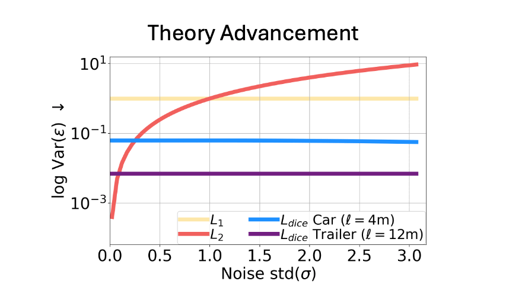

<div align="center">


# SeaBird: Segmentation in Bird's View with Dice Loss Improves Monocular 3D Detection of Large Objects

### [KITTI-360 Demo](https://www.youtube.com/watch?v=SmuRbMbsnZA) | [nuScenes Demo] | [Project](http://cvlab.cse.msu.edu/project-seabird.html) | [Talk](https://www.youtube.com/watch?v=-6CxDymLZ38) | [Slides](https://docs.google.com/presentation/d/15OqUDMIo8vf96vByifpv2npq3aq4xmS38HwjT1wt31U/) | [Poster](https://docs.google.com/presentation/d/15XmI7EAMUzj__5b_Pvdo1c0LTSlqBnONWy3upgfxWfM/)

[](https://paperswithcode.com/sota/3d-object-detection-from-monocular-images-on-7?p=seabird-segmentation-in-bird-s-view-with-dice) 	
[](https://paperswithcode.com/sota/3d-object-detection-on-nuscenes-camera-only?p=seabird-segmentation-in-bird-s-view-with-dice)

[](https://arxiv.org/abs/2403.20318)
[](https://opensource.org/licenses/MIT)
[](https://visitorbadge.io/status?path=abhi1kumar%2FSeaBird)
[](https://github.com/abhi1kumar/SeaBird)


   <p style="font-size:1.2em">
      <a href="https://sites.google.com/view/abhinavkumar"><strong>Abhinav Kumar</strong></a><sup>1</sup> ·
      <a href="https://yuliangguo.github.io"><strong>Yuliang Guo</strong></a><sup>2</sup> ·
      <a href="https://scholar.google.com/citations?user=cL4bNBwAAAAJ&hl=en"><strong>Xinyu Huang</strong></a><sup>2</sup> ·
      <a href="https://www.liu-ren.com"><strong>Liu Ren</strong></a><sup>2</sup> ·
      <a href="http://www.cse.msu.edu/~liuxm/index2.html"><strong>Xiaoming Liu</strong></a><sup>1</sup><br>
      <sup>1</sup>Michigan State University, <sup>2</sup>Bosch Research North America, Bosch Center for AI
   </p>


in [CVPR 2024](https://cvpr.thecvf.com/Conferences/2024/)
   <p align="center">
      
   </p>
</div>

> Monocular 3D detectors achieve remarkable performance on cars and smaller objects. However, their performance drops on larger objects, leading to fatal accidents. Some attribute the failures to training data scarcity or the receptive field requirements of large objects. In this paper, we highlight this understudied problem of generalization to large objects. We find that modern frontal detectors struggle to generalize to large objects even on nearly balanced datasets. We argue that the cause of failure is the sensitivity of depth regression losses to noise of larger objects. To bridge this gap, we comprehensively investigate regression and dice losses, examining their robustness under varying error levels and object sizes. We mathematically prove that the dice loss leads to superior noise-robustness and model convergence for large objects compared to regression losses for a simplified case. Leveraging our theoretical insights, we propose SeaBird (Segmentation in Bird's View) as the first step towards generalizing to large objects. SeaBird effectively integrates BEV segmentation on foreground objects for 3D detection, with the segmentation head trained with the dice loss. SeaBird achieves SoTA results on the KITTI-360 leaderboard and improves existing detectors on the nuScenes leaderboard, particularly for large objects.
   <p align="center">
      
   </p>


## Citation

If you find our work useful in your research, please consider starring the repo and citing:

```Bibtex
@inproceedings{kumar2024seabird,
   title={{SeaBird: Segmentation in Bird's View with Dice Loss Improves Monocular $3$D Detection of Large Objects}},
   author={Kumar, Abhinav and Guo, Yuliang and Huang, Xinyu and Ren, Liu and Liu, Xiaoming},
   booktitle={CVPR},
   year={2024}
}
```

## Single Camera (KITTI-360) Models

See [PanopticBEV](PanopticBEV)

#### Model Zoo

We provide logs/models/predictions for the main experiments on KITTI-360 Val /KITTI-360 Test data splits available to download here.

| Data_Splits | Method  | Config<br/>(Run)                                          | Weight<br>/Pred  | Metrics | Lrg<br/>(50) | Car<br/>(50) | Mean<br/>(50) | Lrg<br/>(25) | Car<br/>(25) | Mean<br/>(25) | Lrg<br/>Seg | Car<br/>Seg | Mean<br/>Seg | 
|------------|---------|------------------------------------------------------------------|----------|--------|----------|-----------|----------|-----------|----------------|----|--------------|-----------|-----------|
| KITTI-360 Val  | Stage 1 | [seabird_val_stage1](experiments/pbev_seabird_kitti360_val_stage1.ini) | [gdrive](https://drive.google.com/file/d/17z02Tj92rQtYYVtiUd2O0grkmQ_ZGgdV/view?usp=sharing) | IoU  |   -   |   -   |   -   |   -   |   -   |   -   | 23.83 | 48.54 | 36.18 
| KITTI-360 Val  | PBEV+SeaBird | [seabird_val](experiments/pbev_seabird_kitti360_val.ini)          | [gdrive](https://drive.google.com/file/d/1iam4F50jX6Hf0WfvkIzkHRkNw_rq3U_p/view?usp=sharing) | AP   | 13.22 | 42.46 | 27.84 | 37.15 | 52.53 | 44.84 | 24.30 | 48.04 | 36.17
| KITTI-360 Test | PBEV+SeaBird | [seabird_test](experiments/pbev_seabird_kitti360_test.ini)        | [gdrive](https://drive.google.com/file/d/1YC3cWVOmX7bdoU21URnP24KlZLOF4q-D/view?usp=sharing) | AP   |   -   |   -   | 4.64  |   -   |   -   | 37.12 |   -   |   -   |   -   


## Multi-Camera (nuScenes) Models

See [HoP](HoP)

#### Model Zoo

**nuScenes Val Results**

|          Model           | Resolution | Backbone     | Pretrain | APLrg |  mAP   |  NDS   |                      Ckpt/Log/Pred                       |
| :----------------------: | :--------: | :----------: | :------: | :---: | :----: | :----: | :------------------------------------------------------: |
| [HoP_BEVDet4D_256](configs/hop_bevdet/hop_bevdet4d-r50-depth.py)    | 256x704  |  ResNet50   | ImageNet-1K | 0.274 | 0.399 | 0.509 | [ckpt](https://github.com/Sense-X/HoP/releases/download/Release/HoP_BEVDet_ep24_ema.pth) / [log](https://github.com/Sense-X/HoP/releases/download/Release/HoP_BEVDet.log) |
| [HoP+SeaBird_256 Stage1](configs/hop_bevdet/hop_seabird_r50_256x704_stage1.py)    | 256x704  |  ResNet50   | ImageNet-1K | - | - | -| [gdrive](https://drive.google.com/file/d/1zQOO2A4Twno6C1nC53RCoazDVuZ_9W0e/view?usp=sharing) | 
| [HoP+SeaBird_256](configs/hop_bevdet/hop_seabird_r50_256x704.py)    | 256x704  |  ResNet50   | ImageNet-1K | 0.282 | 0.411 | 0.515 | [gdrive](https://drive.google.com/file/d/1dmVQW8yDE423mm6AKBM2o1_3F3V59dXQ/view?usp=sharing) |   
| [HoP+SeaBird_512 Stage1](configs/hop_bevdet/hop_seabird_r101_512x1408_stage1.py)   | 512x1408 |  ResNet101   | ImageNet-1K | - | - | - | [gdrive](https://drive.google.com/file/d/1D44imXsFSYg9WE-kdnE-SH-G_gjXvxlw/view?usp=sharing) |
| [HoP+SeaBird_512](configs/hop_bevdet/hop_seabird_r101_512x1408.py)   | 512x1408 |  ResNet101   | ImageNet-1K | 0.329 | 0.462 | 0.547 | [gdrive](https://drive.google.com/file/d/1pgMzLGjXh5A_P3XR7CmQju5qXenTAXAJ/view?usp=sharing) |
| [HoP+SeaBird_640 Stage1](configs/hop_bevdet/hop_seabird_vov99_640x1600_stage1.py)   | 640x1600 |  V2-99   | DDAD15M | - | - | - | [gdrive](https://drive.google.com/file/d/1cbVkituogo_e5ILMrC8Z8NdemrfQL2uV/view?usp=sharing) |
| [HoP+SeaBird_640](configs/hop_bevdet/hop_seabird_vov99_640x1600.py)   | 640x1600 |  V2-99   | DDAD15M | 0.403 | 0.527 | 0.602 | [gdrive](https://drive.google.com/file/d/1dz1w0DQrjgw1xm6u6Kp4csNThYkYPFhu/view?usp=sharing) |

**nuScenes Test Results**

|          Model           | Resolution | Backbone     | Pretrain | APLrg |  mAP   |  NDS   |                      Ckpt/Log/Pred                       |
| :----------------------: | :--------: | :----------: | :------: | :---: | :----: | :----: | :------------------------------------------------------: |
| [HoP+SeaBird_512 Test](configs/hop_bevdet/hop_seabird_r101_512x1408_test.py)   | 512x1408 |  ResNet101   | ImageNet-1K | 0.366 | 0.486 | 0.570 | [gdrive](https://drive.google.com/file/d/1Y39kVTdw0OXN45u6UedgXfYhePFZ-0Xt/view?usp=sharing) |
| [HoP+SeaBird_640 Val](configs/hop_bevdet/hop_seabird_vov99_640x1600.py)   | 640x1600 |  V2-99   | DDAD15M | 0.384 | 0.511 | 0.597 | [gdrive](https://drive.google.com/file/d/1dz1w0DQrjgw1xm6u6Kp4csNThYkYPFhu/view?usp=sharing) |

## Acknowledgements
We thank the authors of the following awesome codebases:
- [PanopticBEV](https://github.com/robot-learning-freiburg/PanopticBEV)
- [BBAVectors](https://github.com/yijingru/BBAVectors-Oriented-Object-Detection) 
- [DEVIANT](https://github.com/abhi1kumar/DEVIANT.git)
- [DOTA_devkit](https://github.com/CAPTAIN-WHU/DOTA_devkit)
- [HoP](https://github.com/Sense-X/HoP)

Please also consider citing them.

## Contributions
We welcome contributions to the SeaBird repo. Feel free to raise a pull request.

### &#8627; Stargazers
[](https://github.com/abhi1kumar/SeaBird/stargazers)

### &#8627; Forkers
[](https://github.com/abhi1kumar/SeaBird/network/members)


## License
SeaBird code is under the [MIT license](https://opensource.org/license/mit).

## Contact
For questions, feel free to post here or drop an email to this address- ```abhinav3663@gmail.com```
